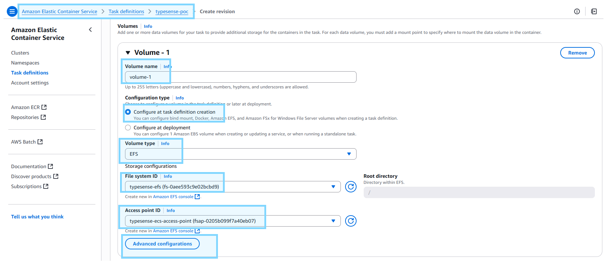

# Setup
- Copy `.env.exmple` to `.env.`
- Set **ENV value** below
    - `TYPESENSE_ENDPOINT`: This is `localhost:8108` for local and LB IP for prod.
- **Up the container with** `docker compose up -d`

# ECR Setup
- **Create ECR repository.**


- **Build & upload to ECR**
    - Ensure env below are set **.env**
        - `AWS_ACCOUNT_ID`
        - `AWS_DEFAULT_REGION`
        - `AWS_ACCESS_KEY_ID`
        - `AWS_SECRET_ACCESS_KEY`
        - `AWS_ECR`
    - Run `cli/deploy_ecr.sh`

# ECS Setup
- **Create ECS cluster**


- **Create Task Definition**


- **Create ECS Service**


# EXEC into ECS Task
- **Create Task Role**
    - **\*\*MUST\*\* add `AmazonSSMManagedInstanceCore` policy**


- Update **Task Role** in **Task Definition**


- **\*\*MUST\*\* redeploy new ECS Task (via new Task Definition)** to reflect Task Role


- Ensure variable below are set in **cli/ecs_set_exec.sh**
    - `REGION`
    - `CLUSTER_ARN`
    - `SERVICE_ARN`

- Run `cli/ecs_set_exec.sh` to **turn ON EXEC Settings**


- Check **EXEC Settings** is ON.


- **\*\*MUST\*\* redeploy new ECS Task (via Force New Deploy)** to reflect EXEC Settings


- Ensure variable below are set in **cli/ecs_ssh.sh** to enter ECS Task.
    - `REGION`
    - `CLUSTER_ARN`

- Run `cli/ecs_ssh.sh <YOUR TASK ID>`


# ALB Setup
- **Create Target Group**


- **Create ALB**


- **Update ECS**


- **Wait Target to be spinned up**


- **Test via LB DNS**


# EFS Setup
- **Create File System**


- **Create Access Point**


- **Security Group inbound & outbound**
    - `EFS security group`: Allow port 2049 in **Inbound**
    - `ECS security group`: Allow port 2049 in **Outbound**


- **Add IAM Policy to Task Role**


- **Set EFS Volume in ECS Task Definition**




- **Deploy NEW ECS task**

# Check EFS Folder (via EC2)

- **Create EC2 instance**


- **\*\*MUST\*\*** allow `PORT 2049` in **Security Group**

- **Change SSH key permission**
    - `sudo chmod 400 ssh-key-2.pem`

- **SSH inside to EC2**
    - `ssh -i "ssh-key-2.pem" admin@ec2-13-215-156-78.ap-southeast-1.compute.amazonaws.com`

- **Setup amazon-efs-utils** 
    - Install dependencies
        ```shell
        sudo apt-get update
        sudo apt-get install -y git make libssl-dev build-essential curl pkg-config nfs-common stunnel4
        ```

    - Install Rush & Cargo
        ```shell
        curl --proto '=https' --tlsv1.2 -sSf https://sh.rustup.rs | sh
        source "$HOME/.cargo/env"
        ```

    - Install amazon-efs-utils
        ```shell
        cd ~
        git clone https://github.com/aws/efs-utils.git
        cd efs-utils
        ./build-deb.sh
        ls -l ./build/ # Find the exact .deb filename
        ```

        ```shell
        sudo dpkg -i ./build/amazon-efs-utils-<YOUR_VERSION>_amd64.deb # Use the exact filename found
        sudo apt-get install -f
        ```

- **Mount to EFS**
    ```shell
    sudo mount -t efs -o tls <YOUR EFS ID>:/ <YOUR MOUNT PATH>
    sudo mount -t efs -o tls fs-*****************:/ /mnt/efs
    ```

- **Check EFS ID & mount path**
    ```
    ps aux | grep -i stunnel | grep -i <YOUR EFS ID> --color=auto
    ps aux | grep -i stunnel | grep -i fs-************ --color=auto
    ```

