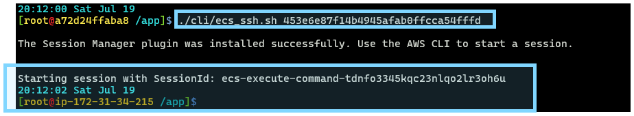
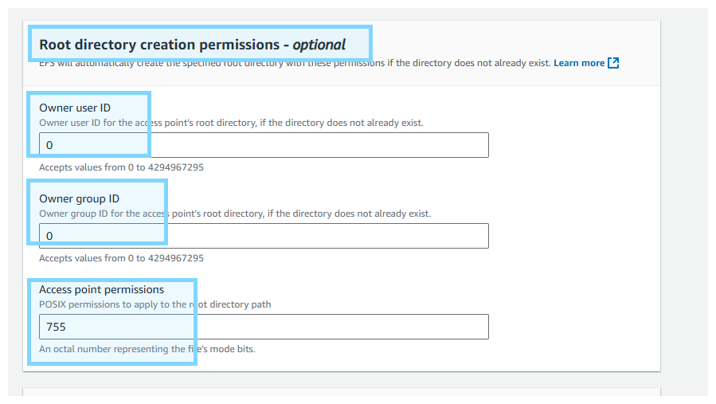
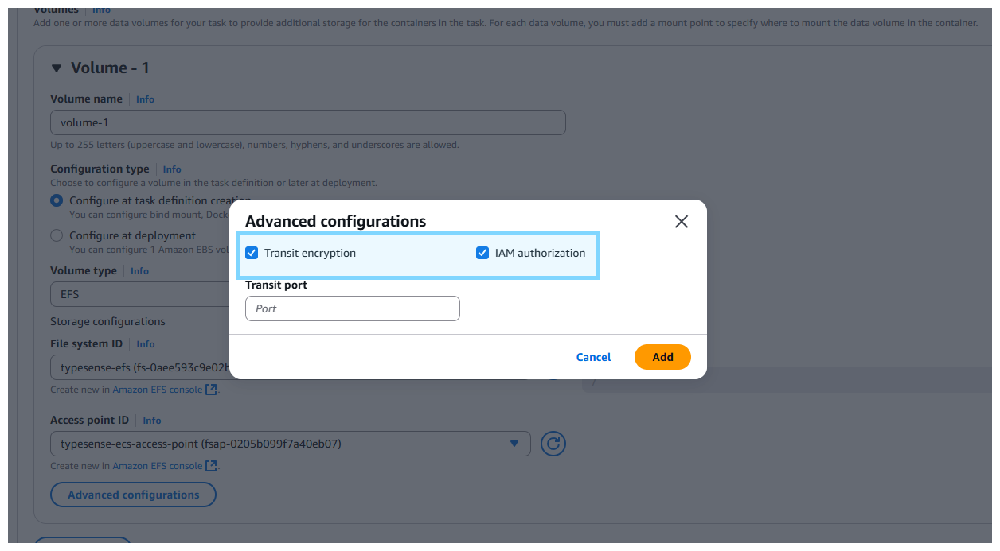

# ECR Setup
- **Create ECR repository.**


- **Build & upload to ECR**
    - Ensure env below are set **.env**
        - `AWS_ACCOUNT_ID`
        - `AWS_REGION`
        - `AWS_ACCESS_KEY_ID`
        - `AWS_SECRET_ACCESS_KEY`
        - `AWS_ECR`
    - Run `cli/deploy_ecr.sh`

# ECS Setup
- **Create ECS cluster**


- **Create Task Definition**


- **Create ECS Service**


# EXEC into ECS Task
- **Create Task Role**
    - **\*\*MUST\*\* add `AmazonSSMManagedInstanceCore` policy**


- Update **Task Role** in **Task Definition**


- **\*\*MUST\*\* redeploy new ECS Task (via new Task Definition)** to reflect Task Role


- Ensure variable below are set in **cli/ecs_set_exec.sh**
    - `REGION`
    - `CLUSTER_ARN`
    - `SERVICE_ARN`

- Run `cli/ecs_set_exec.sh` to **turn ON EXEC Settings**


- Check **EXEC Settings** is ON.


- **\*\*MUST\*\* redeploy new ECS Task (via Force New Deploy)** to reflect EXEC Settings


- Ensure variable below are set in **cli/ecs_ssh.sh** to enter ECS Task.
    - `REGION`
    - `CLUSTER_ARN`

- Run `cli/ecs_ssh.sh <YOUR TASK ID>`



# ALB Setup
- **Create Target Group**


- **Create ALB**


- **Update ECS**


- **Wait Target to be spinned up**


- **Test via LB DNS**


# EFS Setup
- **Create File System**


- **Create Access Point**




- **Security Group inbound & outbound**
    - `EFS security group`: Allow port 2049 in **Inbound**
    - `ECS security group`: Allow port 2049 in **Outbound**


- **Add IAM Policy to Task Role**


- **Set EFS File System Policy**

```json
{
    "Version": "2012-10-17",
    "Id": "EFSFileAccessPolicy",
    "Statement": [
        {
            "Sid": "AllowAccessFromECSThroughAccessPoint",
            "Effect": "Allow",
            // update Task Role ARN
            "Principal": {
                "AWS": "arn:aws:iam::107698500998:role/ecs-typesense-task-role"
            },
            "Action": [
                "elasticfilesystem:ClientMount",
                "elasticfilesystem:ClientWrite"
            ],
            // update EFS ARN
            "Resource": "arn:aws:elasticfilesystem:ap-southeast-1:107698500998:file-system/fs-0aee593c9e02bcbd9",
            "Condition": {
                "StringEquals": {
                    // update EFS access point ARN
                    "elasticfilesystem:AccessPointArn": "arn:aws:elasticfilesystem:ap-southeast-1:107698500998:access-point/fsap-0205b099f7a40eb07"
                }
            }
        }
    ]
}
```

- **Set EFS Volume in ECS Task Definition**





- **Deploy NEW ECS task**

# Check EFS Folder (via EC2)
