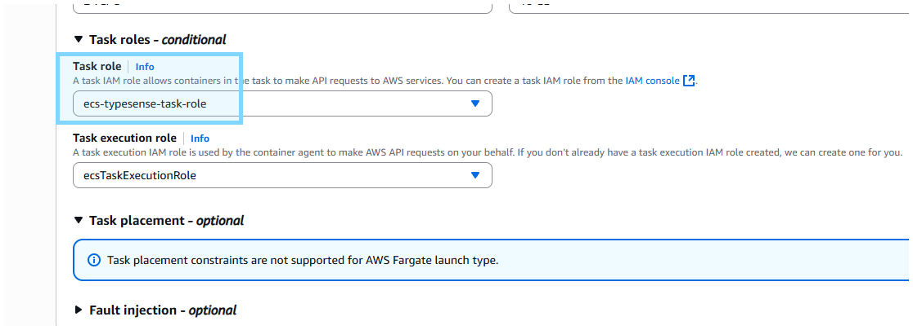

# [Optional] ECR Setup
- **Create ECR repository.**

- **Build & upload to ECR**
    - Ensure env below are set **.env**
        - `AWS_ACCOUNT_ID`
        - `AWS_REGION`
        - `AWS_ACCESS_KEY_ID`
        - `AWS_SECRET_ACCESS_KEY`
        - `AWS_ECR`
    - Run `cli/deploy_ecr.sh`

# [Optional] ECS Setup
- **Create ECS cluster**

- **Create Task Definition**

- **Create ECS Service**

# [Optional] EXEC into ECS Task
- **Create Task Role**
    - **\*\*MUST\*\* add `AmazonSSMManagedInstanceCore` policy**

- Update **Task Role** in **Task Definition**

- **\*\*MUST\*\* redeploy new ECS Task (via new Task Definition)** to reflect Task Role

- Ensure variable below are set in **cli/ecs_set_exec.sh**
    - `REGION`
    - `CLUSTER_ARN`
    - `SERVICE_ARN`

- Run `cli/ecs_set_exec.sh` to **turn ON EXEC Settings**

- Check **EXEC Settings** is ON.

- **\*\*MUST\*\* redeploy new ECS Task (via Force New Deploy)** to reflect EXEC Settings

- Ensure variable below are set in **cli/ecs_ssh.sh**
    - `REGION`
    - `CLUSTER_ARN`
- Run `cli/ecs_ssh.sh <YOUR TASK ID>`

